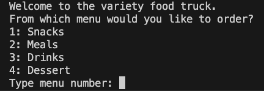
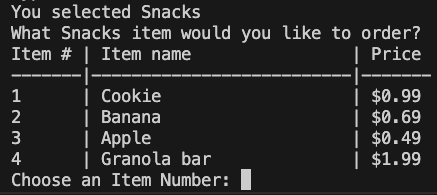
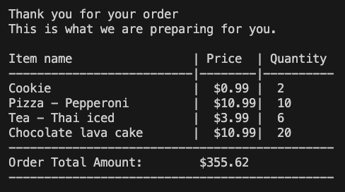

# python_challenge_1

# Python Challenge 1 program
This is a program for an interactive ordering system from a food truck menu
It allows the user to choose a menu category from avilable options. 
Once user selects a menu category, it then provides of list of available menu items.
It will also display corresponding menu item price. 

## Use
When this program is executed it will display following menu options 

User will need to pick one of the available options. If user inputs a negative number,
alpha characters then it will prompt the user to choose again.
Once user inputs a valid menu category number, then it will display a submenu something
like following - 

Once user makes a item selection and quantity, it will ask tyhe user if they would 
like to order any more items(s). User can make additional menu category selection and individual food items in a 
submenu. 
Once user completes input of all required items, it will display following 
order list and total cost.

